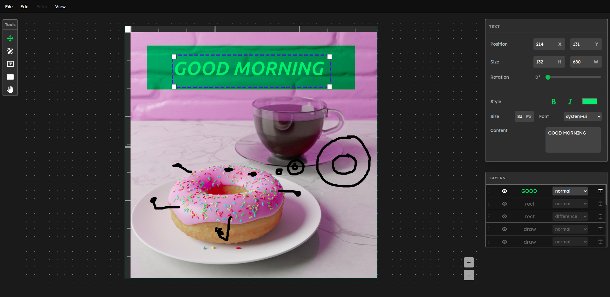

# Image Tinker

> A lightweight, browser-based image editor built on HTML Canvas.

Built around a Command pattern store, every canvas operation is a reversible
command object, giving the editor a full undo/redo history. Elements are rendered
on an HTML5 Canvas.

---

## 

## Features

**Canvas**

- Custom canvas size with presets
- Grid and ruler overlays
- Export as PNG

**Layers**

- Layer based editing
- Reorder layers via the layer panel
- Blend mode controls
- Opacity controls

**Elements**

- Rectangle with fill and stroke controls
- Freehand draw with color and line width
- Text with font, styles and size controls
- Image import with crop tool

**Editing**

- Drag, resize, and rotate any element
- Undo / redo
- Copy / paste elements
- Pan and zoom canvas

---

## Getting Started

#### Prerequisites

- Node.js v18+
- npm

#### Installation

1. Clone the repo

```bash
   git clone https://github.com/yourname/image-tinker.git
```

2. Install dependencies

```bash
   cd image-tinker
   npm install
```

3. Start the dev server

```bash
   npm run dev
```

4. Open `http://localhost:5173`

---

## Project structure

```
src/
├── component/
│   ├── Canvas/         # Core canvas rendering, interaction, and coordinate system
│   ├── Layers/         # Layer panel with blend mode controls
│   ├── MenuBar/        # File, Edit, View, Filter menus
│   ├── Properties/     # Element property panels (draw, image, text, rect)
│   └── ToolBar/        # Tool selection
├── store/              # Zustand store
└── types/              # Global TypeScript types for elements and store
docs/
├── types.md
├── store.md
├── architecture.md
├── coordinate-system.md
└── systems/
```

---

## Documentation

For an in-depth explanation of the codebase :

- [Types](docs/types.md)
- [Store](docs/store.md)
- [systems / Zoom](docs/systems/zoom.md)
- [systems / Pan](docs/systems/pan.md)
- [sytems / Rotate](docs/systems/rotate.md)
- [sytems / Drag](docs/systems/drag.md)

---

## License

MIT © 2026 Dixit Regmi
